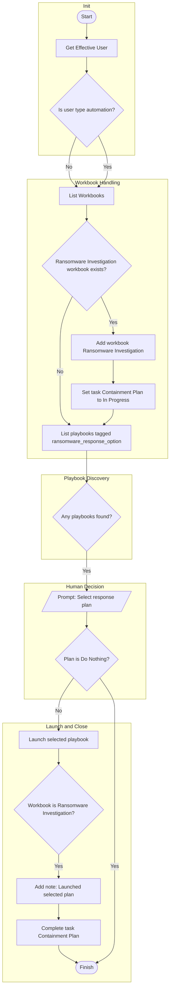
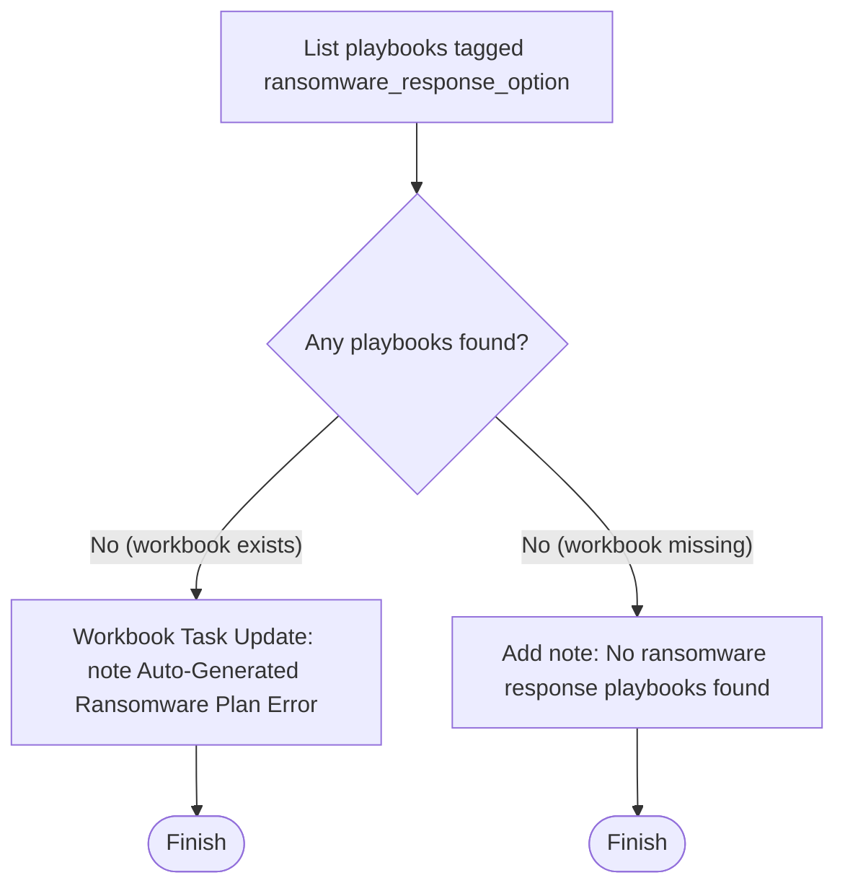
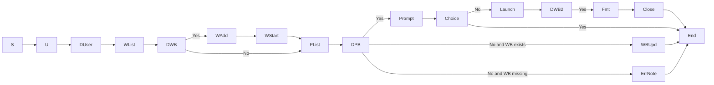

# Ransomware Precursors — Response Plan 

---

## 1) Main control flow (with phases)

---

## 2) No-playbook branches (errors or notes)

---

## 3) Edge summary (compact)

---

### Notes
- Tag selectable child playbooks with **ransomware_response_option**.
- Suggested children: Aggressive Containment, Quarantine Only, Monitor and Hunt.
